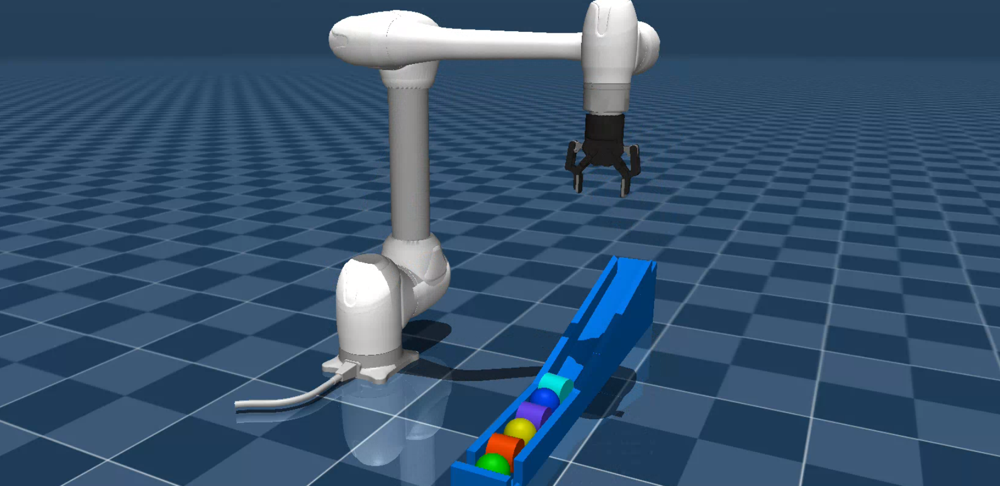

# Use Doosan robots on MuJoCo


## Overview

This package enables controlling Doosan robots in MuJoCo simulation using ROS 2.

Supported models:
- H-SERIES :  **h2515** (blue), **h2017** (blue)
- M-SERIES :  **m1013** (white), **m0609** (white), **m1509** (white), **m0617** (white)
- A-SERIES :  **a0509** (blue), **a0912** (blue)
- E-SERIES :  **e0509** (white)

## Prerequisites

1. Install MuJoCo from Google DeepMind:  
   - Download from official [releases](https://github.com/google-deepmind/mujoco/releases) and unzip the file. 
   (For more info, refer to the website: https://mujoco.org/)  

2. Set `MUJOCO_DIR` (update path & version) in your `~/.bashrc`:
   ```bash
   export MUJOCO_DIR=/PATH/TO/MUJOCO/mujoco-3.x.x
   ```


3. Install [MuJoCo ROS 2 control](https://github.com/moveit/mujoco_ros2_control) package:
   ```bash
   # For package dependencies
   sudo apt update && sudo apt install libglfw3-dev

   cd ~/ros2_ws/src
   git clone https://github.com/moveit/mujoco_ros2_control.git
   cd mujoco_ros2_control
   git checkout bd2d576331a1be2d2701f35f1b736297d09f1cea

   cd
   cd ~/ros2_ws/src
   colcon build
   source install/setup.bash
   ```
   *Note:* Recent versions have sim-time issue. Extra change or tuning may be required.  
   

## Launch with MuJoCo
- **Launch m1013 in blank scene:**  
   ```bash
   ros2 launch dsr_bringup2 dsr_bringup2_mujoco.launch.py
   ```

## Demo example
- **Launch m1013 with gripper in a demo scene:**
   ```bash
   ros2 launch dsr_bringup2 dsr_bringup2_mujoco.launch.py model:=m1013 gripper:=2f85 scene_path:=demo/slope_demo_scene.xml
   ```
- **In another terminal, run Pick & Place movements:**    
   ```bash
   ros2 run dsr_example slope_demo
   ```

### Demo Video
[](https://youtu.be/Jqaam6x79t4)

## [Usage documentation](doc/doc.md)
