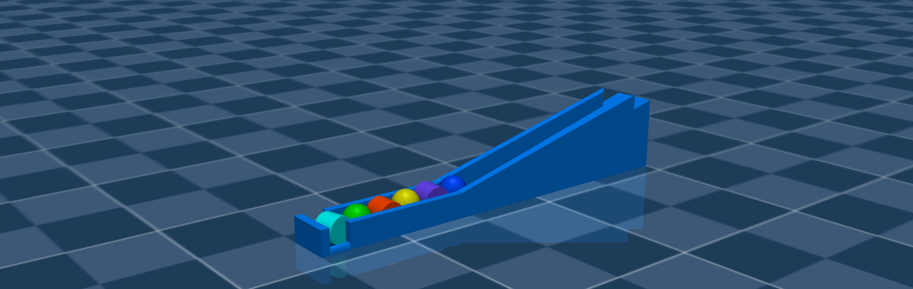
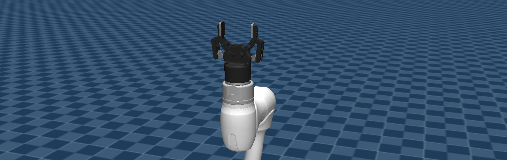

# Usage Documentation

This documentation explains how to use dsr mujoco briefly.

## Launch Parameters for `dsr_bringup2_mujoco.launch.py`

```bash
ros2 launch dsr_bringup2 dsr_bringup2_mujoco.launch.py model:=m1013 gui:=true gripper:=2f85 scene_path:=demo/slope_demo_scene.xml
```

### **model**

- Doosan robot model name (Default: `m1013`)

### **gui**

- Activate/Deactivate Rviz2 GUI (`true`/`false`)

### **gripper**

- Gripper name to use with (Default: `2f85`)

### **scene_path**

- Path for MuJoCo environment to launch the robot in (Default: `none`)

---

## Changing the MuJoCo Environment

If you want to modify the simulation environment in MuJoCo, you need to edit or make a new `scene.xml` file.



Scene files are located in `dsr_description2/mujoco_models/<model_name>/` or `dsr_description2/mujoco_models/demo/` directories. In these files, you can add or modify elements such as floor, lighting, and objects.

### Compiler Tag

The `<compiler>` tag plays a crucial role in defining simulation settings, such as calculation methods and setting the `meshdir` attribute (which specifies the relative or absolute path to asset files).

```xml
<compiler angle="radian" meshdir="../" />
```
**Note**: For the robot model to load successfully, `meshdir` should point to `mujoco_models` directory properly.

### Option Tag

The `<option>` tag is important for fine-tuning physics simulation, especially for complex contact with friction.

Example for slope_demo_scene.xml:
```xml
<option cone="elliptic" impratio="200" integrator="implicitfast"/>
```
The current options above are tuned to allow stable gripping. In a different scene, you might need a additional tuning. 
For detailed information on these parameters, please refer to the official [MuJoCo XML documentation](https://mujoco.readthedocs.io/en/stable/XMLreference.html).

**TIP:** You can use MuJoCo's native `./simulate <your_scene.xml>` command-line tool (check the `bin` folder in mujoco installations) to easily load and debug your MJCF scenes.

---

## Gripper Operation

Unlike the main DSR manipulator, grippers should use individual ROS 2 controllers.

### 2F85 Gripper Example

The 2F85 gripper uses the `forward_command_controller/ForwardCommandController`, which is a standard ROS 2 controller.

This controller manages the `left_driver_joint` of the gripper by `/{ns}/mj/left_knuckle_position_controller/commands` topics.



You can find an example of its usage in the `dsr_example2/dsr_example/dsr_example/demo/slope_demo.py` script.

To control the gripper individually from the terminal, you can use the following CLI command:

```bash
ros2 topic pub /dsr01/mj/left_knuckle_position_controller/commands std_msgs/msg/Float64MultiArray "layout:
  dim: []
  data_offset: 0
data: [0.0]"
```

*   **Open:** `data: [0.0]`
*   **Close:** `data: [0.8]`


